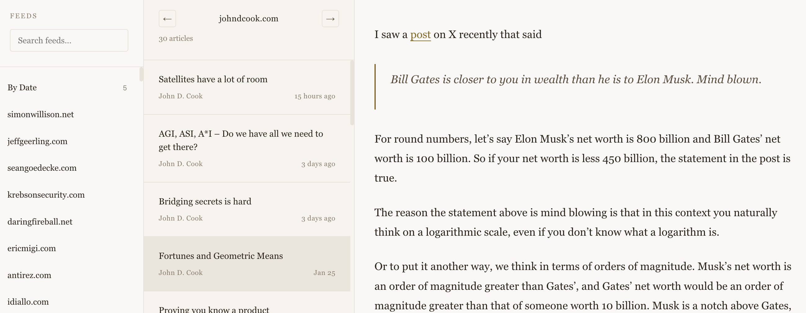

# OpenBook

A personal, indie-style RSS reader and knowledge collector built with Node.js. Designed for **Humans** and optimized for **AI Agents**(OpenClaw, OpenCode, Claude CoWork, Manus, etc.). OpenBook doesn't just read feeds; it helps you capture, materialize, and organize knowledge in a format both you and your LLMs will love.


*Modern, indie-style multi-column reader interface.*


*Notion-like waterfall feed for notes and highlights.*

## Core Features

- **Multi-source RSS Reading**: Follow your favorite blogs and news sites.
- **OPML Support**: Automatically load `.opml` files placed in the project root.
- **Three-column Layout**: Elegant feed navigation, article listing, and content reading.
- **Indie Aesthetic**: Warm tones, serif typography, and a minimal, focused design.
- **Responsive Navigation**: Adaptive layout for desktop and mobile devices.

## Knowledge Collection Features

OpenBook goes beyond simple reading with powerful gathering tools:

- **Article Materialization**: Fetch full article content and convert it into clean Markdown with YAML front matter for your personal archive.
- **Resource Collection**: Automatically download and localize images/resources within saved articles to ensure they remain accessible offline.
- **Note-taking System**: Create Markdown notes linked directly to articles.
- **Activity Feed**: A waterfall-style "Notes Home" to track your highlights, saves, and reading history.
- **Markdown Export**: Export your activity history into a structured Markdown table, perfect for importing into Notion or Obsidian.
- **Read/Favorite Status**: Keep track of what you've read and what you want to keep.

## Built for AI Agents (Agent-Native)

OpenBook is designed to be the perfect knowledge base for your AI workflows:

- **Markdown-First**: Articles and notes are stored in pure Markdown. This is the native language of LLMs, ensuring perfect context retrieval.
- **CLI-Powered**: A robust command-line interface allows AI agents (like the one you're using) to navigate and read your library without a GUI.
- **Structural Clarity**: Uses YAML front matter for metadata, making it easy for agents to grep, filter, and index.
- **Local-First & Transparent**: All your data lives in your filesystem. No complex APIs, no rate limits, and perfect privacy for local RAG (Retrieval-Augmented Generation).
- **SEO for Agents**: Structured HTML and semantic layout help web-crawling agents understand your digital garden effortlessly.

## Data Structure (AI-Native)

OpenBook stores everything in a transparent, file-based structure that AI agents can easily parse:

```text
data/
├── articles/             # Materialized articles (HTML -> MD)
│   └── 2026/
│       └── 02/
│           ├── example-article.md
│           └── example-article-assets/  # Localized images/resources
├── notes/                # User notes and highlights
├── openbook.db           # SQLite database for state and activity logs
└── index.json            # Grep-friendly index of feeds and articles
```

### Example Materialized Article (`.md`)

Each saved article is a clean Markdown file with YAML front matter:

```markdown
---
title: "Getting the main thing right"
url: "https://seangoedecke.com/getting-the-main-thing-right/"
feed_url: "https://www.seangoedecke.com/rss.xml"
published_at: "Thu, 05 Feb 2026 00:00:00 GMT"
source: "html"
---

# Getting the main thing right

When you’re running a project in a tech company...
```

## Installation

```bash
npm install
```

## Usage

### Web Interface

```bash
npm start
```

Access the interface at `http://localhost:3000`.

- **Main Reader**: `/index.html` (or `/`)
- **Notes Home**: `/notes.html` (Activity feed and highlights)

### Command Line Tool

OpenBook preserves its roots with a fully functional CLI.

```bash
# View all articles
node cli.js

# List all RSS feeds
node cli.js list

# View articles from a specific feed
node cli.js read 1
```

## Tech Stack

- **Backend**: Node.js, Express, SQLite (via `better-sqlite3`)
- **RSS Engine**: `rss-parser`
- **Markdown Logic**: `turndown` (HTML to MD conversion)
- **Frontend**: Vanilla JavaScript, CSS, HTML5

## Development and Testing

The project includes a suite of tests covering core logic:

```bash
npm test
```

Tests include article sorting, date filtering, feed statistics, and content detection logic.

## OPML Configuration

Simply place your `.opml` files in the root directory. OpenBook will scan and load them on startup. The current build supports 200+ subscriptions through included OPML files.

## API

| Endpoint | Method | Description |
|---|---|---|
| `/api/feeds` | GET | List all subscriptions |
| `/api/articles` | GET | List recent articles |
| `/api/article/materialize` | POST | Fetch and save article as Markdown |
| `/api/article/state` | POST | Update read/favorite status |
| `/api/article/note` | POST | Create a note for an article |
| `/api/activity` | GET | Fetch the activity log |
| `/api/export/markdown` | GET | Export activity as Markdown file |
