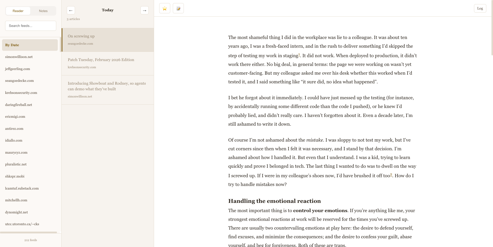
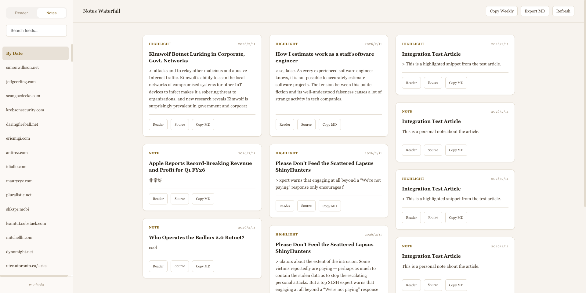
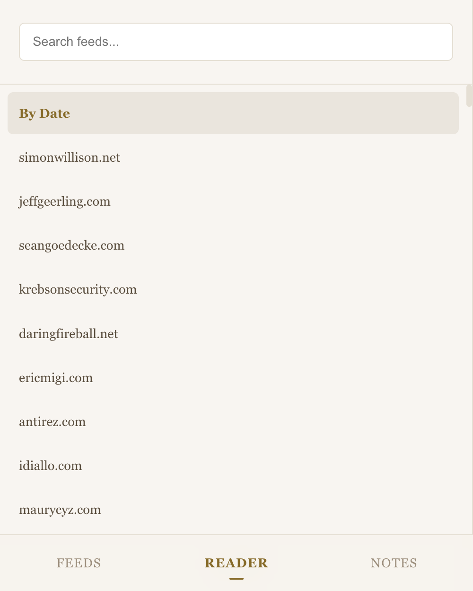
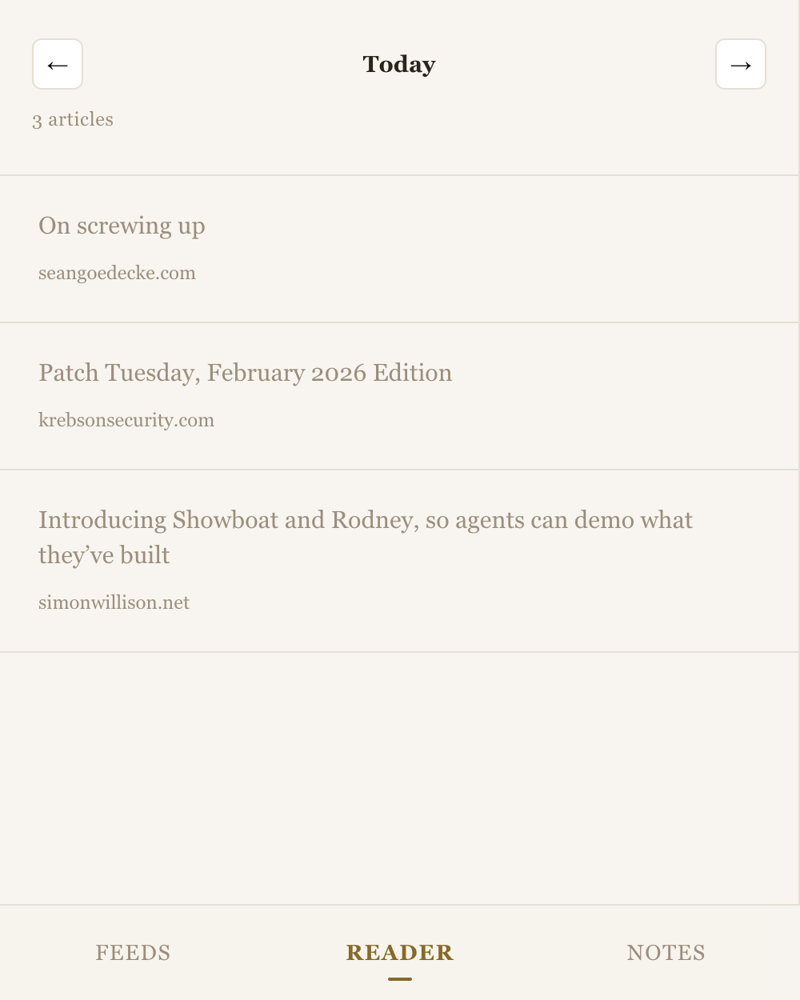
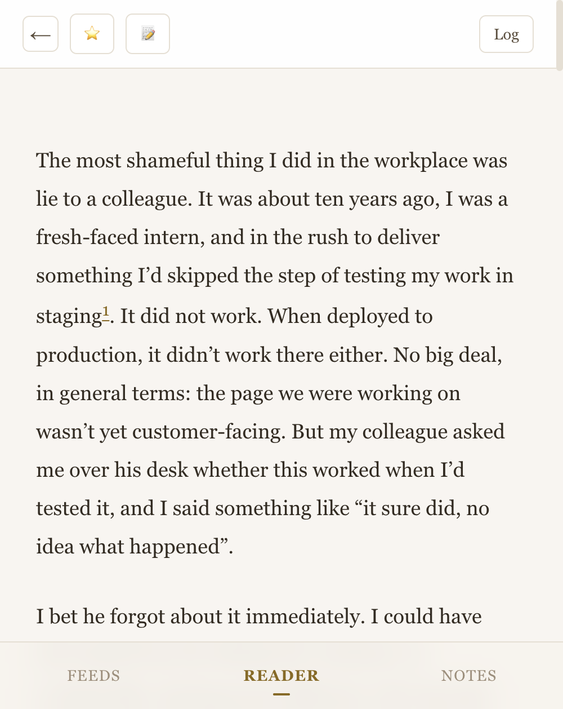
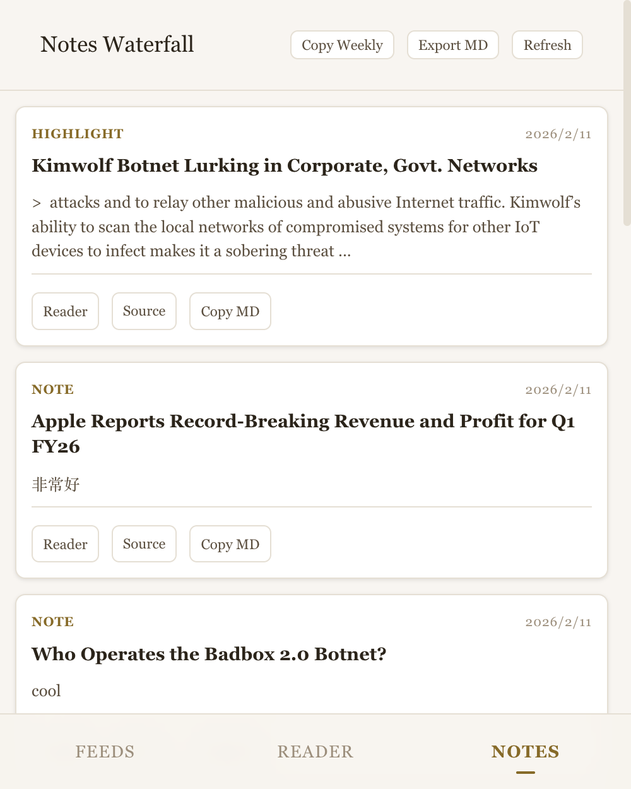
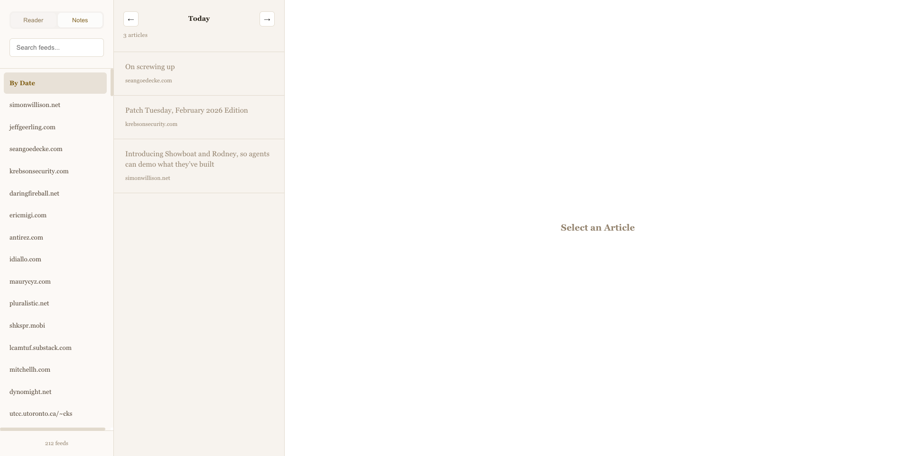

# OpenBook

OpenBook is an indie-style RSS reader and knowledge collector built with Node.js.
It is designed for **humans** (focused reading experience) and **AI agents** (clean, local, parseable data).

| Desktop Reader | Desktop Notes |
|---|---|
|  |  |

<p align="center"><em>Unified desktop experience: Reader + Notes in one integrated layout.</em></p>

| Mobile Feeds | Mobile Reader (List) | Mobile Reader (Detail) | Mobile Notes |
|---|---|---|---|
|  |  |  |  |

<p align="center"><em>Mobile-first stacked views with minimalist text navigation and focused article reading.</em></p>

## Interface Deep Dive (More Visual Details)

### Desktop: Reader Focus



- Left rail for feed/source context
- Middle column for article queue and scanning
- Right pane for long-form reading and note capture

### Desktop: Notes Waterfall

| Top of Notes | Scrolled Notes |
|---|---|
|  |  |

- High-signal cards: favorites, notes, highlights
- Infinite scroll to review historical captures
- Deep-link affordance back to source article context

### Mobile Flow: Entry -> Reading -> Detail -> Notes

| Step 1: Feeds | Step 2: Reader List |
|---|---|
|  |  |

| Step 3: Reader Detail | Step 4: Notes |
|---|---|
|  |  |

- Text-first bottom navigation reduces UI noise
- View states are mutually exclusive to avoid touch/scroll conflicts
- Reader detail uses a focused layout for immersive article reading

## Why OpenBook

Most RSS readers stop at "read later." OpenBook goes further:

- Read from many sources
- Save full articles as Markdown
- Capture notes and highlights
- Build a durable personal knowledge base for both yourself and LLM workflows

## Core Features

- **Unified Reader + Notes UI**: Switch between reading and note waterfall views in a single interface.
- **Multi-source RSS Reading**: Follow blogs/news feeds with OPML import support.
- **Knowledge Waterfall**: Review high-signal actions (**Favorites**, **Notes**, **Highlights**) with infinite scroll.
- **Precise Highlight Capture**: Selection-based popover positioning for reliable highlight actions.
- **Deep Linking**: Jump from a note/highlight back to the original article context.
- **Paper-like Visual Design**: Warm palette, serif typography, and distraction-light layout for deep reading.
- **Mobile-First Adaptation**: Dedicated stacked mobile views with strict state-driven navigation.
- **Local-First Storage**: Data stays on your filesystem, ready for grep, scripts, and local RAG.

## Knowledge Collection Workflow

OpenBook helps you turn browsing into reusable knowledge:

1. **Ingest** feeds and read articles
2. **Materialize** full content to Markdown (`HTML -> MD + front matter`)
3. **Capture** notes/highlights linked to source articles
4. **Export** activity as Markdown for Obsidian/Notion/reviews

## Data Structure (AI-Native)

```text
data/
├── articles/             # Materialized articles (HTML -> MD)
│   └── 2026/
│       └── 02/
│           ├── example-article.md
│           └── example-article-assets/  # Localized images/resources
├── notes/                # User notes and highlights
├── openbook.db           # SQLite database for state and activity logs
└── index.json            # Grep-friendly index of feeds and articles
```

## Quick Start

### 1) Install

```bash
npm install
```

### 2) Run Web App

```bash
npm start
```

Open: `http://localhost:3000`

### 3) Optional: Use CLI

```bash
# View recent articles (default)
node cli.js

# List all RSS feeds
node cli.js list

# Read articles from specific feed
node cli.js read 1

# Search articles by keyword
node cli.js search "AI"

# Show last N articles
node cli.js recent 20

# Verbose fetch-source diagnostics (network/cache/min-interval/memory)
node cli.js -v

# Knowledge Management
node cli.js notes              # List all notes and highlights
node cli.js highlights         # Alias for notes
node cli.js favorites          # List all favorited articles
node cli.js activity 30        # Show recent activity log

# Actions
node cli.js open 5             # Open article in browser
node cli.js materialize 3      # Save article as Markdown
node cli.js export 7           # Export last 7 days as Markdown

# Statistics
node cli.js stats              # Show database statistics
node cli.js book index --json  # Agent-friendly /data index (DB + index.json + dirs)
node cli.js help               # Show help
```

**CLI Features:**
- Search articles by keyword in title or content
- View notes, highlights, and favorites
- Export knowledge to Markdown
- Open articles in system browser
- Materialize articles for offline reading
- Database statistics and activity logs

## Development & Testing

```bash
npm test                           # Run all tests
node --test test/cli.test.js       # CLI tests only
node --test test/rss.test.js       # RSS parser tests only
node --test test/date-filter.test.js # Date filter tests only
node --test test/integration.test.js # Integration tests only
```

**Test Coverage:**
- CLI function behavior with temporary SQLite fixtures
- CLI argv dispatch (`node cli.js ...`) and command routing
- Activity log querying via `payload_json` semantics
- Notes/Favorites/Highlights statistics correctness
- Search usage and error-path output validation

**Testing Notes (CLI):**
- `cli.js` exports command handlers for direct unit testing.
- Entry execution is guarded by `require.main === module` to avoid side effects when imported.
- Command-level tests run in isolated temp directories and use lightweight OPML fixtures to avoid flaky network/DNS dependencies.

## Tech Stack

- **Backend**: Node.js, Express, SQLite (`better-sqlite3`)
- **RSS**: `rss-parser`
- **Markdown**: `turndown`
- **Frontend**: Vanilla JavaScript (ES6+), CSS Grid/Flexbox

## API

| Endpoint | Method | Description |
|---|---|---|
| `/api/feeds` | GET | List all subscriptions |
| `/api/articles` | GET | List recent articles |
| `/api/article/materialize` | POST | Fetch and save article as Markdown |
| `/api/article/state` | POST | Update read/favorite status |
| `/api/article/note` | POST | Create a note or highlight |
| `/api/activity` | GET | Fetch activity log (Favorites, Notes, Highlights) |
| `/api/export/markdown` | GET | Export activity as Markdown review |
| `/api/sync/warm` | POST | Trigger sync warm-up (`verbose=true` supported) |
| `/api/sync/status` | GET | Get latest sync status/summary |
| `/api/debug/recent-events` | GET | Read recent structured debug events (local observability) |

## Screenshot Maintenance Playbook (Actionbook)

This project uses README screenshots as part of product communication. The workflow below is based on real maintenance experience.

### Recommended workflow

1. Start app locally:
   ```bash
   npm start
   ```
2. Search Actionbook manual first (required by Actionbook best practice):
   ```bash
   actionbook search "openbook screenshot" --url http://localhost:3000
   ```
3. If no manual exists for local pages, use fallback:
   - `actionbook browser snapshot`
   - then `actionbook browser click/fill/eval` based on current page state
4. Capture desktop screenshots:
   - `reader_interface.png`
   - `notes_interface.png`
5. Capture mobile screenshots in separate states:
   - `mobile_feeds.png`
   - `mobile_reader.png`
   - `mobile_notes.png`
6. Always close browser session:
   ```bash
   actionbook browser close
   ```

### Actionbook lessons learned (important)

- **Action Manual first**: even for familiar pages, run `actionbook search` first. Localhost often has no indexed manual, so fallback is expected.
- **`wait-nav` can timeout on SPA pages**: OpenBook is state-driven and may not trigger full navigation; prefer `snapshot`/state checks over relying only on navigation waits.
- **Mobile screenshots can accidentally look identical**: if view state is not switched correctly, feeds/reader screenshots may duplicate. Explicitly switch states before each capture.
- **Use app view functions for deterministic state**: for this codebase, `switchToReaderView()`, `switchToNotesView()`, `toggleMobileSidebar(true)`, `closeMobileSidebar()` are reliable for screenshot setup.
- **Stable README rendering**: Markdown table layout is more consistent than free-floating `` tags across GitHub widths.
- **Keep commits focused**: include screenshot assets used by README; exclude temp/debug files.

## Observability (Local-first Debugging)

Enable structured server-side observability:

```bash
OPENBOOK_WEB_VERBOSE=true OPENBOOK_SYNC_VERBOSE=true npm start
```

What you get:
- API request lifecycle logs (`request.start` / `request.end`)
- Correlated IDs: `requestId`, `traceId`, `actionId`
- Sync source diagnostics (`network_fetch`, `cache_fallback`, `min_interval_skip`, `memory_cache_hit`)
- Recent event buffer via `/api/debug/recent-events`

Quick trace workflow:
1. Reproduce in UI
2. Find `traceId` in logs
3. Filter log lines by that `traceId`
4. Cross-check `/api/debug/recent-events?limit=100`

## Documentation

For architecture notes and implementation lessons (unified interface, mobile behavior, state-driven layout), see [AGENTS.md](./AGENTS.md).
